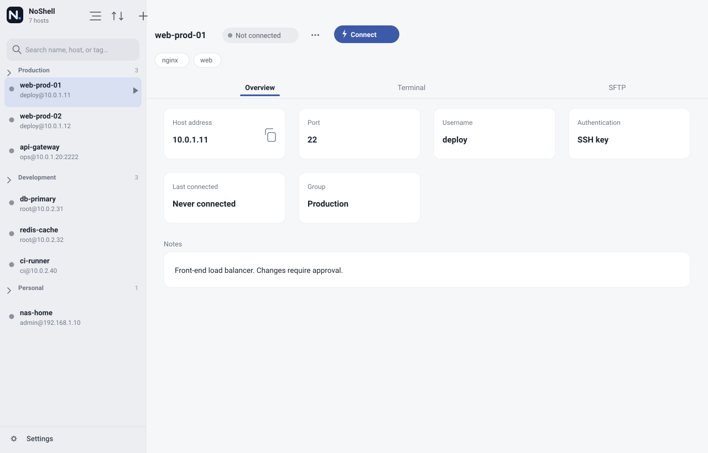
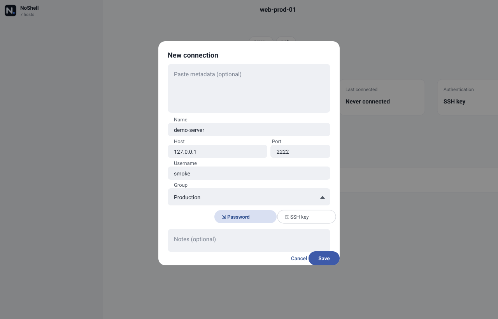
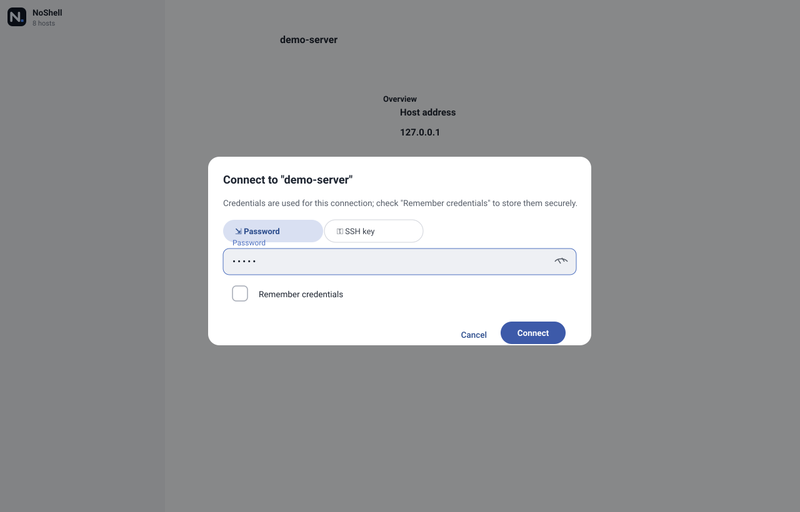
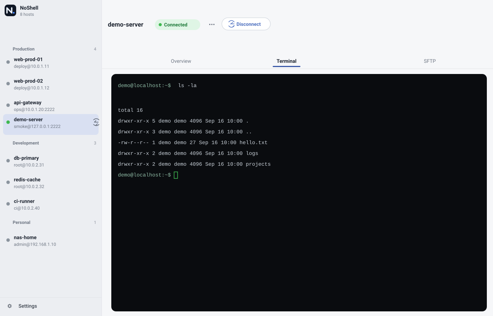
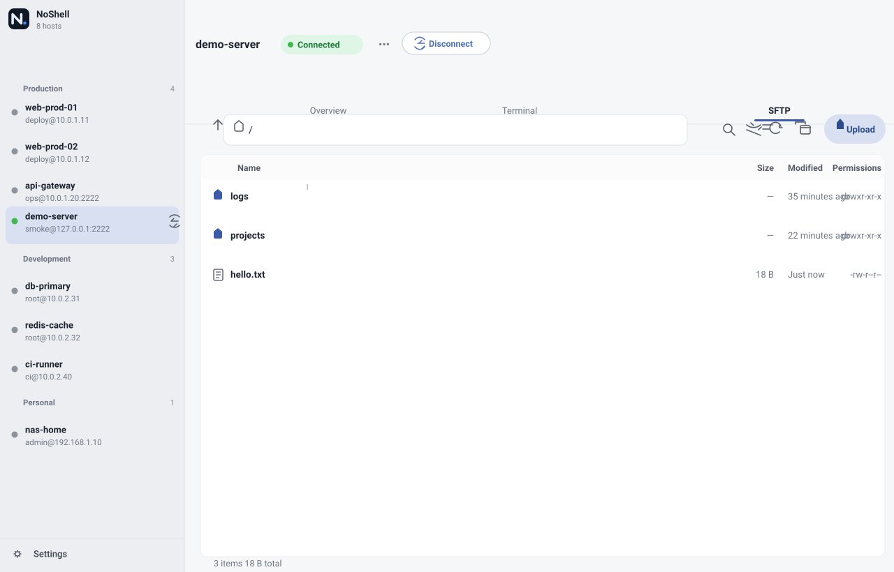
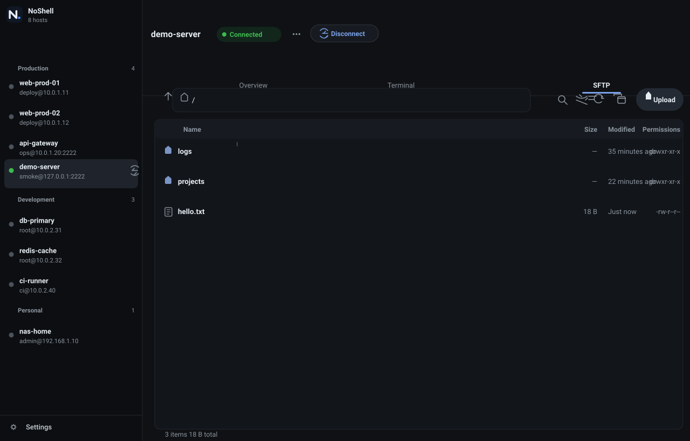
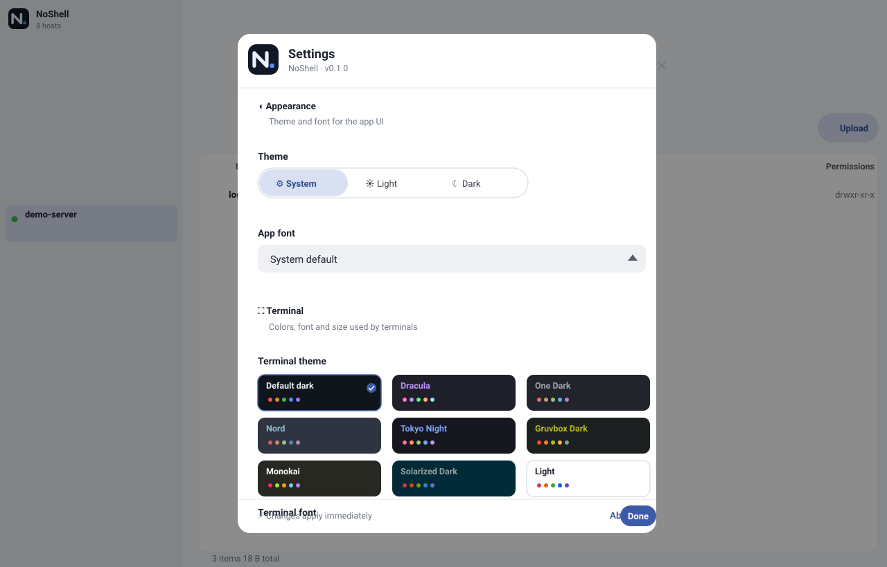
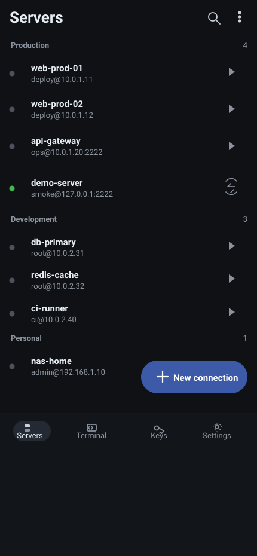

<div align="center">


# NoShell

NoShell — a cross-platform SSH connection manager with terminal, SFTP file browsing and secure credential storage — one Flutter codebase for desktop and mobile.

[](https://github.com/chengvar-glitch/no-shell/actions/workflows/ci.yml)
**[English](README.md)** · [中文](README_zh.md)



*Desktop split view: grouped host list · host overview · terminal / SFTP in the same window*

</div>

## Features

- **SSH terminal** — a fully interactive terminal built on dartssh2 + xterm: xterm-256color, adaptive resize, password / keyboard-interactive / private-key authentication
- **SFTP file browser** — directory navigation, upload / download with progress and cancel, rename, delete, create folder; reuses the authenticated SSH connection instead of opening a new one
- **Host key verification (TOFU)** — records the server public-key fingerprint on first connect; refuses to connect when it changes and offers an explicit clear-and-reconnect action, protecting against man-in-the-middle attacks
- **Secure credential storage** — with "remember credentials" checked, secrets are encrypted at rest via the system keystore (macOS Keychain / Windows Credential Manager / Linux libsecret); unchecked, they never leave memory
- **Host management** — groups, tags, notes and last-connected time; export the host list as a text backup and import with automatic Chinese/English key recognition, deduplicated by host + port + user; the new/edit connection form also accepts that same text pasted as metadata to prefill its fields, which stay editable by hand
- **Bilingual UI** — English and Chinese, following the system or pinned manually
- **Themes & terminal styles** — light / dark themes follow the system; terminal color presets and fonts are configurable

## Screenshots

| New connection | Authentication |
| --- | --- |
|  |  |

| Terminal | SFTP browser |
| --- | --- |
|  |  |

| Dark theme | Settings |
| --- | --- |
|  |  |

| Mobile layout (narrow screens switch to bottom navigation) |
| --- |
|  |

> The screenshots are generated by `integration_test/screenshots_test.dart` driving the real app against a throwaway local server bound to 127.0.0.1 — no real host information is included.

## Platform support

| Platform | Status |
| --- | --- |
| macOS | ✅ Supported (Apple Silicon) |
| Windows | ✅ Supported |
| Linux | ✅ Supported |
| Android | ✅ Supported |
| iOS | ✅ Supported |
| Web | ⚠️ UI works; SSH connections are not supported (no raw TCP in browsers) |

Wide desktop screens (≥640px) get a two-pane layout; narrow screens automatically switch to a mobile bottom-navigation shell. Both share the same data and session layers.

## Installation

Grab the artifact for your platform from [Releases](https://github.com/chengvar-glitch/no-shell/releases). Pushing a `v*` tag triggers GitHub Actions to build and publish automatically:

| Platform | Artifact |
| --- | --- |
| Windows | Portable zip + MSIX installer (with a one-off self-signed `.cer` — import it into "Trusted Root Certification Authorities" before installing the MSIX) |
| macOS | arm64 zip (Apple Silicon) |
| Linux | deb + rpm (installs to `/opt/noshell`, includes a desktop entry) |
| Android | APK |
| Web | Static site zip |

## Building from source

```bash
flutter pub get
flutter run -d macos   # or -d windows / linux / chrome / <device-id>
```

## Development

```bash
flutter analyze                 # static analysis (must be clean before committing)
flutter test                    # full test suite
flutter test test/xxx_test.dart # single test file
dart format <file>              # format changed files
flutter gen-l10n                # regenerate after editing arb files
```

SSH smoke test against a real host (credentials are passed on the command line only, never written to the repo):

```bash
dart run tool/smoke_ssh.dart <host> <port> <user> --password <password>            # terminal path
dart run tool/smoke_ssh.dart <host> <port> <user> --password <password> --sftp     # SFTP path
dart run tool/smoke_ssh.dart <host> <port> <user> --password <password> --shell    # PTY path
```

### Regenerating the README screenshots

```bash
# 1. Start the throwaway local demo server (binds to 127.0.0.1 only, account smoke/smoke, needs asyncssh)
python tool/dev_sftp_server.py /tmp/demo-root 2222

# 2. Drive the real app and capture each screen; PNGs are written to docs/screenshots/
flutter test integration_test/screenshots_test.dart -d macos
```

> The macOS app is sandboxed, so relative paths resolve inside the app container (`~/Library/Containers/com.noshell/Data/`); copy the files back into the repo afterwards.

## Architecture overview

- `lib/ssh/` — session layer: transport abstraction (`SshTransport`) with the dartssh2 adapter, TOFU fingerprint storage (`host_key_store.dart`), SFTP abstraction and adapter, secure credential storage
- `lib/store.dart` + `lib/server_persistence.dart` — host list state and persistence
- `lib/widgets/`, `lib/mobile/` — desktop split-pane skeleton and mobile tab skeleton
- `lib/l10n/` — arb source files (en / zh); generated code in `lib/l10n/generated/`
- `test/` — widget, session, SFTP, persistence, localization and more; `test/support/` holds shared fakes
- `integration_test/` — integration tests driving the real app (the README screenshot generator)
- `tool/` — dev scripts: the SSH smoke test (`smoke_ssh.dart`) and the throwaway local demo server (`dev_sftp_server.py`)

Platform capabilities go through conditional exports (web falls back to stubs); `lib/` never imports `dart:io` directly.

## Security model

- Private keys and passwords live only in the system keystore; without "remember credentials" they stay in memory
- Host public-key fingerprints are recorded locally following TOFU; on mismatch the connection is refused and the old record is only cleared after explicit confirmation
- Host key fingerprints are not secrets and are stored alongside the host list; real credentials must never enter code, tests or the repository
